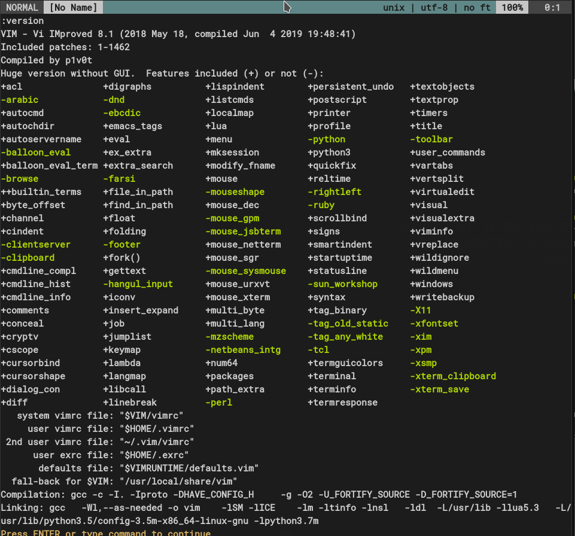

<p align="center"></p>

 <p align="center"> An alternative learning resource for Vim </p>
		 

- [Quit the Vim](#quit-the-vim)
- [What is Vim?](#what-is-vim)
  * [History of Vim](#history-of-vim)
  * [Vim Forks and Neovim](#vim-forks-and-neovim)
- [Creating a file](#creating-a-file)
- [Vim modes](#vim-modes)
- [General](#general)
- [Moving around](#moving-around)
- [Entering insert mode](#entering-insert-mode)
- [Working more than one file](#working-more-than-one-file)
  * [using tabs](#using-tabs)
- [Repeating commands without repeating yourself](#repeating-commands-without-repeating-yourself)
  * [repating more than one command by recording](#repating-more-than-one-command-by-recording)
- [Editing](#editing)
  * [find and change](#find-and-change)
- [Some frequently used commands](#some-frequently-used-commands)
- [Configure](#configure)
  * [dotfiles and .vimrc](#dotfiles-and-vimrc)
  * [mapping](#mapping)
    + [leader variable](#leader-variable)
  * [Adding plugin](#adding-plugin)
    + [adding plugin with vim-plug](#adding-plugin-with-vim-plug)
  * [Creating your own plugin](#creating-your-own-plugin)
    + [Hello World plugin](#hello-world-plugin)
  * [An incomplete list of plugins](#an-incomplete-list-of-plugins)
- [Links](#links)
  * [sites](#sites)
  * [books](#books)
  * [cheatsheets](#cheatsheets)
- [Building Vim from source code](#building-vim-from-source-code)


### [Quit the Vim](https://stackoverflow.blog/wp-content/uploads/2017/05/country_stuck_vim-1-2-1024x1024.png)

```
<esc> :q! <enter> 
```

### What is Vim?

Vim is a highly configurable text editor for fast and effective text editing.

Vim is not designed for hold users hand, it's a tools and must be learned how to use. Vim is not a word
processor.

#### History of Vim<sup>1</sup>

*ed* was the original Unix text editor. It was written at a time when video displays were
uncommon. Source code was usually printed onto a roll of paper and edited on a
teletype terminal.
 Commands entered at the terminal would be sent to a mainframe
computer for processing, and the output from each command would be printed. In
those days, the connection between a terminal and a mainframe was slow, so much
so that a quick typist could outpace the network, entering commands faster than
they could be sent for processing. In this context, it was vital that ed provide a terse
syntax. Consider how p prints the current line, while %p prints the entire file.
ed went through several generations of improvements, including em (dubbed the
*“editor for mortals”*), en, and eventually *ex*.

 By this time, video displays were more
common. ex added a feature that turned the terminal screen into an interactive window
that showed the contents of a file. Now it was possible to see changes as they were
made in real time. The screen-editing mode was activated by entering the `:visual` command, or just `:vi` for short. And that is where the name vi comes from.
Vim stands for vi improved. That’s an understatement—I can’t stand to use regular
vi! Look up :h vi-differences for a list of Vim features that are unavailable in vi. Vim’s
enhancements are essential, but it still owes much to its heritage. The constraints
that guided the design of Vim’s ancestors have endowed us with a highly efficient
command set that’s still valuable today.

#### Vim Forks and Neovim

[Neovim](https://neovim.io/) is a fork of Vim and defines itself extension of Vim with the goal make easy for contribution.

### Creating a file 

```
$ vim <enter>
$ vim filename
$ vim directory/filename
```

### Vim modes

Vim provides different modes to users for focus on content.

* normal mode: vim starts with this mode. esc is used for enter this mode. `:h Normal-mod`
* insert mode: used for add text to editor. [insert komutları](insert-moda-geçme)nın biriyle bu moda geçilir.  `:h Insert-mod`
* visual mode: used for select an area on text. Character-wise selection can be made by v, line-wise selection can be made by V, and block-wise with C-v
* command mode: From the normal mode, can be entered by : and used for enter command. Example: `:h ctrl-r <enter>`

### General

```
$ vimtutor          Official tutorial of Vim
:h user-manual
:h subject          help about the *subject*. Ex: `:h python` (Ctrl-] to click hyperlinks, and Ctrl-T to back)

:q                  quit
:w                  write
:saveas filename    save as
:wa[!]              write all
:wq                 write and quit
:x                  ditto
:wqa                write quit all
:q!                 if file is changed and not supposed to saved, quit
```
```
u                undo example: 4u
C-r              redo (push Ctrl button then r)
U                Undo all line

s=seconds, m=minute, h=hour, d=day
:earlier #m     turn back # minute ago of the file Ex: :earlier 2m or :ea 3d
:later #m       turn back # minute later state of the file Ex: :later 7s  or  :lat 9h
```

```
y                yank, copy 
yy               yank all line
p                paste to below of cursor
P                Paste to above of the cursor
c                cut, cut the selected area
"<reg>y          copy selected area to regıster (a-z den register) 
"<reg>p          paste to register (a-z register) 
.                repeat latest command
```

```
:term    start a terminal session inside vim
:!<cmd>  vim'den ayrılmadan shell'den <cmd> komutunu calistir Ex: `!g++ -wall -std=c++14 main.cpp`, `!ruby %`
:!<cmd>  run a shell command inside vim, ex:`!g++ -wall -std=c++14 main.cpp`, `!ruby %`
:sh      go to shell, return by `exit`
C-z      send vim to background, return by fg
```

### Moving around

```
:h motion
                                k
h        cursor left            ^
j        cursor down       h <     > l
l        cursor right           v
k        cursor up              j
```

```
0        beginning of line
$        end of line
```

```
w        jump to first character of next word (Notations are count on a word)
e        jump to last character of the currect word
b        jump to first character of the current word
```

```
H        jump to *top* of the screen
M        jump to *middle* of the screen
L        jump to *lower* of the screen
```

```
C-b      a full screen size up
C-f      a full screen size down
C-u      a half screen size up
C-d      a half screen size down
```

```
zt       move screen from cursor position to the top
z<enter> ditto
zb       move screen from cursor position to the bottom
z-       ditto
zz       make cursor position of the screen middle
z.       ditto
```
```
%        jump to matching paranthesis
(        previous sentence
)        next sentence
{        previous paragraph
}        next paragraph
[{       jump beginning of the code block
]}       jump end of the code block
gd       go to declaration (of a variable in programming)
```

```
w        jump beginning of next word (punctuation considered words)
e        jump end of the next word
ge       jump end of the previous word
b        jump begining of the previous word
^        jump to first non space character on line
gg       top of the file
G        bottom of the file
+        begining of the next line
-        beginning of the previous line
.        repeat the last command
```
 
```                                                                                         v            v
E        jump beginning of the next word (punctuation not considered words) Example:  e (abcd)    E (abcd)
W        jump end of the next word (punctuation not considerd as words) 
B        jump begining of the previous word
#G       go to line number #  Ex: 38G
#gg      same as #G
```

In more general<sup>2<sup>:
```
                gg
                 ?
                C-b
                 H
                 {
                 k
^ F T ( b ge h       l w e ) t f $
                 j
                 }
                 L
                C-f
                 /
                 G
```

### Entering insert mode ##

```
/~~~~~~~~~~~\
|command mod|
\~~~~~~~~~~~/
|          |
^ :/       v Esc Esc
|          |
/~~~~~~~~~~\<---Esc------/~~~~~~~~~~\
|normal mod|             |insert mod|
\~~~~~~~~~~/--aAiIoOsS-->\~~~~~~~~~~/
 |        | 
 v vV     ^ Esc
 |        | 
/~~~~~~~~~~\
|visual mod|
\~~~~~~~~~~/

```
``` 
i        add text before cursor
I        add text after cursor
a        add after cursor
A        add text to end of line
o        make newline below to current line and add text
O        make newline above to current line and add text
s        delete character on current character
S        delete all line
cc       ditto
cw       delete the word and enter insert mode (change word)
shift-r  Change word in-place (like insert in Windows)
```

### Working more than one file
```
:h usr_08.txt
```

```
C-ws       split current window horizontally (alternative :split)
C-ws a.txt create a a.txt file and start editing
 
C-wv       split current window vertically (alternative :vsplit)
C-ww       jump to next window
```

```
C-w h      jump left from current window
C-w j      jump below from current window
C-w k      jump above from current window
C-w l      jump left from current window
C-w t      jump to window on the top
C-w b      jump to window on the bottom
```
```
C-wq       close current window
:close     ditto
:only      close windows other than current
```
```
C-w#<      resize current window to the left # of times (default 1)
C-w#>      resize current window to the right # of times (default 1)
:res #     resize horizontally splitted window # of times
```
```
C-wH       move current window to the left
C-wJ       move current window to the below
C-wK       move current window to the above
C-wL       move current window to the left
```

```
$ vim -o3 f1.txt f2.txt f3.txt      open the files horizontally splitted
$ vim -O3 f1.txt f2.txt f3.txt      open the files vertically splitted

$ vim f1.txt f2.txt f3.txt          open the files at one but show only one at a time (:next to next file and  :prev)

```
#### using tabs

```
$ vim -p f1.txt f2.txt              open f1.txt and f2.txt files with tab

:tabedit filename   edit specified file in a new tab
:tabfind filename   open the file in a new tab and start edit
```
```
:tabn       next tab
:tabp       previous tab
:tabfirst   first tab
:tablast    last tab
```
```
:tabm {i}    move current tab to i+1 place
```
```
:tabclose i   close tab i
:tabclose     close current tab
:tabonly      close other tabs but current
```
```
:tabs         list tabs
```

### Repeating commands without repeating yourself

**operator [number] move** or **[number] operator move**

```
c3w      or 3cw, change 3 words (cw cw cw)
4j       jjjj 
2w       w w,  go to the begining of 2 next words
2dd      delete 2 lines
```
#### repating more than one command by recording

Recording more than 1 move would be greatly useful. Vim has 26 register(a-z), which can be considered
26 different clipboard!!! 
1. start recording with q and choose a register to record on. Ex: qa
2. exit from recording with Esc.
3. apply what you record qith @<reg> Ex: @a<enter>
        
```
q[a-z]   start recording
@[a-z]   apply record
```

### Editing

```
X        delete the character before the cursor
dw       delete the next word
dW       delete the next word including while space 
d^       delete till beginning of the line
d$       delete till end of the line
D        ditto
dd       delete all line
dib      delete content inside the paranthesis
```

```
r<c>     change the character <c> 
```

```
*        find next word under cursor
f<c>     find character <c> from current cursor position
'.       jump to last edited line
g;       jump back to last editted position
```
```
:ab slm selam         in insert mode, when written 'slm'<space> change it with 'selam' 
```

```
:g/^#/d  delete all the lines start with #
:g/^$/d  delete all the empty lines
```

#### find and change

```
:s/old/new      change first 'old' with 'new' on the current line
:s/old/new/g    change all 'old' with 'new' on the current line
:s/old/new/gc    change all 'old' with 'new' on the current line but before ask for permission

:#,#s/old/new/g   change all 'old' with 'new' between the lines # and #
:%s/old/new/g    change all 'old' with 'new' on the current file
:%s/old/new/gc    change all 'old' with 'new' on the current file but before ask for permission
```

### Some frequently used commands

```
yyp     copy line and paste to below
yyP     copy line and paste to above
ddp     swap current line with the below
ea      add end of the word
xp      exchange two chacter  Ex: sometihng -> something
dgg     delete from current line to beginning of the file
```

### Configure 

#### dotfiles and .vimrc 
```
:h vimrc-intro
:options
```

On Unix-like operating systems, most of system tools are C programs and some of these programs take arguments written in a file. Dotfiles, files with starts with ., gives these paramaters and 
define program behaviour on runtime. You can read interesting story of born this trend from [here](https://plus.google.com/101960720994009339267/posts/R58WgWwN9jp).
Dotfiles are specially useful when from current machine to another, it make you avoid to configure from beginning. Keeping dotfiles in a version control system is a good practice, most of users share their 
dotfiles in public repos.

 `.bashrc`, `.profile`, `.vimrc` are examples of dotfiles.

.vimrc file defines setting of Vim at runtime. There are a system .vimrc and user .vimrc in *home* directory of every user. The one on home directory override system .vimrc. 
If you don't have .vimrc file on your home, you can create by vim .vimrc. Look: [default .vimrc içeriği](https://gist.github.com/anonymous/c966c0757f62b451bffa)

#### mapping 

```
:help mapping
```
we can create shortcuts using mapping.

General formula:

> map shortcut longCommands

we need to add mappings to .vimrc make them permanent.

 there are 3 basic mappings for three modes:

- to work in normal mode **nmap**
- to work in insert mode **imap**
- to work in visual mode **vmap**


```
nmap m <C-d>        "in normal mode: when typed m, ctrl-d (half page below) will be executed
imap jk <ESC>       "in inesert mode, when typed jk, pass to normal modee
```
Some special characters:

| Karakter | Anlamı |
|:---------|-------:|
| `<Esc>` | Esc(ape) |
| `<CR>`  | Enter |
| `<Enter>` | Enter |
| `<Tab>` | Tab |
| `<S-Tab>` | Shift + Tab |
| `<M-d>` | Alt + d |
| `<A-d>` | Alt + d |
| `<Space>` | Space |
| `<BS>`  | Backspace |
| `<Del>` | Delete
| `<S-p>` | Shift + p |

```
:h key-notation
```

To check whether your mapping conflict other mappings:
```
:verbose map shortcut 
```

Sometimes mappings conflict other mappings, so that defining your mappings as no-recursive is a good practice.

The example below demosrates such a case, the _o_ goes one line below and enter insert mode. The expected 4 lines 
below and enter insert mode behaviour, end up with endless loop. The _o_ will call _4o_ and it will call another _4o_ etc.

```
nmap o 4o 
```
To make no-recursing mapping we add *nore*

- for normal mode **nnoremap**
- for insert mode **inoremap**
- for visual mode **vnoremap**

The mapping below does what we expect, from normal mode, goes 4 lines below and enter insert mode:

```
nnoremap o 4o
```

we can specify mappings to filetypes:

```
autocmd FileType cpp nnoremap <f5> :w <bar> !clang++ -stdlib=libc++ -fsyntax-only -std=c++1z % <cr>
autocmd FileType d nnoremap <f8> :call DTest()<cr>
autocmd FileType text nnoremap <C-s> :w <cr>
```

##### leader variable
You can choose a variable as a _leader_ and you can use it in mapping prefix.

```
let mapleader = "-"
```
I chose `-` character as a _leader_.
 
```
nnoremap <leader>ve :vsplit $MYVIMRC<cr>
```
Now when I want to edit the .vimrc, in normal mod, I can press `-ve` characters.


To see all the mappings:
```
:map
```

#### Adding plugin

The easiest way to adding plugin to Vim is make use of a plugin manager. There are more than one plugin managers:

- [Pathogen](https://github.com/tpope/vim-pathogen)
- [Vim8 packages](http://vimhelp.appspot.com/repeat.txt.html#packages)
- [NeoBundle](https://github.com/Shougo/neobundle.vim)
- [vim-plug](https://github.com/junegunn/vim-plug)
- [dein.vim](https://github.com/Shougo/dein.vim)
- [minpac](https://github.com/k-takata/minpac/)
- [VAM](https://github.com/MarcWeber/vim-addon-manager)
- [Vundle](https://github.com/VundleVim/Vundle.vim)

##### adding plugin with vim-plug

vim-plug is a plugin manager for Vim. It allows you to add, update, remove plugins.

run the follong command:
```bash
$ curl -fLo ~/.vim/autoload/plug.vim --create-dirs \
    https://raw.githubusercontent.com/junegunn/vim-plug/master/plug.vim
```
and than add your .vimrc to this:

```vims
call plug#begin()
" plugins
call plug#end()
```
Add the plugin you want to install between`call plug#begin()` and `call plug#end()` commands. Most of vim plugins
host and maintain on Github.

For example, to add plugin on the link https://github.com/tpope/vim-sensible you should put:

```vims
call plug#begin()
Plug 'https://github.com/tpope/vim-sensible'
call plug#end()
```
or

```vims
call plug#begin()
Plug 'tpope/vim-sensible'
call plug#end()
```
and then invoke

`:PlugInstall`

command, that's it!

#### Creating your own plugin
`:h plugin`

You can write your own plugin! A Vim plugin is a program written in vimscript (VimL) language. Generally consist of
following parts.

```
MyAwesomePlugin/
.
├── autoload   Autoloaded functions according to filetype
├── doc        Documantation file
├── ftdetect   File type detection
├── ftplugin   Plugin for a particular file type
├── plugin     Plugin file
├── syntax     Syntax highlighting
└── after     
└── indent    
└── compiler   

```

##### Hello World plugin
Add the folder contain the plugin to `runtimepath`:

```
set runtimepath+=/path/to/helloworld
```
```
helloworld/
.
├── autoload
│   └── greet.vim
├── plugin
    └── greet.vim
```

```VimScript
" plugin/greet.vim
if exists('g:loaded_greet')
	finish
endif
let g:loaded_greet = 1

command! Greet call greet#hello_world()
```
```VimScript
" autoload/greet.vim
function! greet#hello_world() abort
	echo "Hello World!!"
endfunction
```

That's all :)) Try with `:Greet` on command mode.

#### An incomplete list of plugins

###### For newcomers
* [vim-sensible](https://github.com/tpope/vim-sensible)

###### Code completion and language client
* [coc.nvim](https://github.com/neoclide/coc.nvim)
* [LanguageCliient-neovim](https://github.com/autozimu/LanguageClient-neovim)
* [vim-lsc](https://github.com/natebosch/vim-lsc)
* [YouCompleteMe](https://github.com/Valloric/YouCompleteMe)
* [deoplete.vim](https://github.com/Shougo/deoplete.nvim)
* [Neocomplete](https://github.com/Shougo/neocomplete.vim)
* [ncm2](https://github.com/ncm2/ncm2)
* [VimCompletesMe](https://github.com/ajh17/VimCompletesMe)
* [completor.vim](https://github.com/maralla/completor.vim)
* [vim-mucomplete](https://github.com/lifepillar/vim-mucomplete)


###### List of language servers
* [Language Servers](https://langserver.org/)

###### Lint and syntax check
* [syntastic](https://github.com/vim-syntastic/syntastic)
* [ALE](https://github.com/w0rp/ale)
* [neomake](https://github.com/neomake/neomake)

###### Snippet
* [Snimate](https://github.com/garbas/vim-snipmate)
* [ultisnips](https://github.com/SirVer/ultisnips)
* [vim-snippets](https://github.com/honza/vim-snippets)
* [neosnippet.vim](https://github.com/Shougo/neosnippet.vim)
* [vim-minisnip](https://github.com/joereynolds/vim-minisnip)

###### Programming language
* [vim-polyglot](https://github.com/sheerun/vim-polyglot)
* [vim-go](https://github.com/fatih/vim-go)
* [rust.vim](https://github.com/rust-lang/rust.vim)
* [vim-cpp-enhanced-highlight](https://github.com/octol/vim-cpp-enhanced-highlight)

###### GUI-like
* [NERDTree](https://github.com/scrooloose/nerdtree)
* [promptline](https://github.com/edkolev/promptline.vim)
* [vim-airline](https://github.com/vim-airline/vim-airline)
* [powerline](https://github.com/powerline/powerline)
* [lightline](https://github.com/itchyny/lightline.vim)

###### Theme and colors
* [vimcolors.com](https://vimcolors.com/)
* [rainglow.io](https://rainglow.io)
* [awesome-vim-colorschemes](https://github.com/rafi/awesome-vim-colorschemes)
* [vim-devicons](https://github.com/ryanoasis/vim-devicons)
* [nerd-fonts](https://github.com/ryanoasis/nerd-fonts)

###### Plugings for better user experience
* [Surround](https://github.com/tpope/vim-surround)
* [Fugitive](https://github.com/tpope/vim-fugitive)
* [vim-commentary](https://github.com/tpope/vim-commentary)
* [ctrlp](https://github.com/ctrlpvim/ctrlp.vim)
* [vim-ctrlspace](https://github.com/vim-ctrlspace/vim-ctrlspace)
* [vim-capslock](https://github.com/tpope/vim-capslock)
* [vim-repeat](https://github.com/tpope/vim-repeat)
* [NrrwRgn](https://github.com/chrisbra/NrrwRgn)
* [vim-obsession](https://github.com/tpope/vim-obsession)
* [vim-gutentags](https://github.com/ludovicchabant/vim-gutentags)

### Links

#### sites

* [Vim.org](https://www.vim.org)
* [Vim Repo](https://github.com/vim/vim)
* [gvim appimages](https://github.com/vim/vim-appimage/releases)
* [neovim.io](https://neovim.io/)
* [neovim nightly builds](https://github.com/neovim/neovim/releases/tag/nightly)
* [vimawesome.com](https://www.vimawesome.com) Vim plugins
* [dotfiles.github.io](https://dotfiles.github.io)
* [yet another dotfile manager](https://yadm.io)

#### books

* Practical Vim: Edit Text at the Speed of Though<sup>1</sup> - Drew Neil
* Modern Vim - Drew Neil
* Learning Vi and Vim Editors - Arnold Robbins, Elbert Hannah
* The VimL Primer: Edit Like a Pro with Vim Plugins and Scripts - Benjamin Klein
* Mastering Vim: Build a software development environment with Vim and Neovim<sup>1</sup> - Ruslan Osipov
* [A Byte of Vim](https://vim.swaroopch.com/) (Online Book)

#### cheatsheets

* http://www.worldtimzone.com/res/vi.html
* http://www.fprintf.net/vimCheatSheet.html
* https://wiki.archlinux.org/index.php/Vim
* http://www.fprintf.net/vimCheatSheet.html
* https://devhints.io/vimscript


### Building Vim from source code

If you're using an Unix based operating system, Vi or Vim is probably preinstalled but Vim needs to some features
that not enabled by default. To enable them you might need to build Vim from its source code.

Which features enabled by default is changing distro to distro, check out with:

```
:version
```

Download repo with Git:

```
$ git clone --depth=1 https://github.com/vim/vim.git
```
```
$ cd vim
```
before start building, we need to do *configure*, this is the phrase you'll choose which features to enable.

```
./configure --help
```
These are the paramaters I use:
```
$ sudo ./configure --enable-fail-if-missing \
--disable-darwin \
--disable-smack \
--disable-selinux \
--enable-luainterp=yes \
--with-python3-command=python3interp \
--enable-python3interp=yes \
--with-python3-config-dir=/usr/lib/python3.5/config-3.5m-x86_64-linux-gnu \
--enable-cscope \
--disable-netbeans \
--enable-terminal \
--enable-autoservername \
--enable-multibyte \
--disable-rightleft \
--disable-arabic \
--disable-farsi \
--enable-fontset \
--enable-gui=no \
--enable-gtk2-check=no \
--enable-gtk3-check=no \
--enable-athena-check=no \
--enable-nextaw-check=no \
--enable-carbon-check=no \
--disable-gtktest \
--with-compiledby=p1v0t
```



 yours might be different according to your need and be ready to search and install third-party libraries. After this step, the files build system need are generated,
with GNU make build tool:
```
$ sudo make -j 8
```
The '-j' parameter says how much core we dedicate to build process, generally the more core passed, the faster build, therefore less build time will take.
End of this process the executables will be created. To make them available by root we need to copy them to appropriate directories:

```
$ sudo make install
```

Don't delete the repo, therefore you can experiment latest features or apply patches, after `git pull` it. The build will take much less because *make* only compile changed files.

-----

- Did you like this document, please leave it a star.
- Do you want to add or edit something, is something important missing? Fork the repo and send a [pull request](https://help.github.com/en/articles/creating-a-pull-request)
- Follow me on Twitter (before twitter mark me as a bot) [@adembubudak](https://twitter.com/adembudak_)

### Licence 

<a href="http://www.wtfpl.net/"></a>
